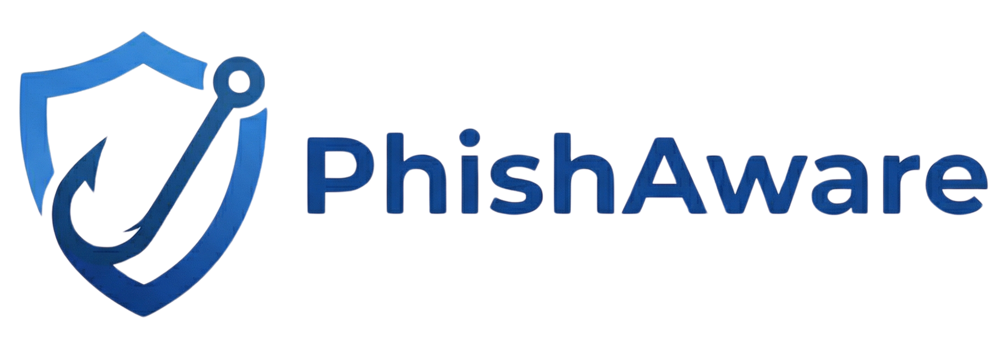

<div align="center">

<picture>
  <source media="(prefers-color-scheme: dark)" srcset="public/logo/logo-horizontal-dark.png">
  
</picture>

# Frontend

### *The face of the phish.*

React 19 · Vite 7 · Tailwind · Bilingual EN/AR with full RTL


</div>

---

## ⚡ Quick Start

```bash
npm install
npm run dev
```

Open 👉 `http://localhost:5173` · Backend must be running too — see [Backend/README.md](../Backend/README.md).

### 🔐 Environment (`.env`)

```env
VITE_API_BASE_URL=http://localhost:8000/api/v1
```

---

## 📁 Project Layout

```
Frontend/src/
├── 📡 api/           Axios + JWT interceptors · endpoints grouped by resource
├── 🔐 contexts/      AuthContext · USER_ROLES · login/logout
├── 🛣️  routes/        createBrowserRouter · ProtectedRoute · GuestRoute
├── 🎨 layouts/       DashboardLayout · PublicLayout
├── 📄 pages/
│   ├── 🔑 auth/         Login · Register · VerifyEmail · AcceptInvitation · Reset
│   ├── 🌐 public/       Landing · Community · Quiz · SimulationCaught · 404
│   ├── 👤 employee/     Dashboard · Quizzes · Training · Badges · Leaderboard
│   ├── 🏢 company/      Dashboard · Simulations · Campaigns · Employees · Analytics
│   └── 🛡️  admin/        Companies · PlatformAnalytics · UserManagement
├── 🧩 components/    Shared UI · NotificationDropdown · Logo · common/
├── 🪝 hooks/         Custom React hooks
├── 🌐 i18n/          English + Arabic translation files
└── 🛠️  utils/         Shared helpers
```

---

## 👥 Four Roles, Four Experiences

<table>
<tr>
<td width="50%" valign="top">

### 🛡️ ADMIN
*Platform superuser*
- Company list & creation
- Platform-wide analytics
- User management

### 🏢 COMPANY
*Runs the full security lifecycle*
- Risk & engagement dashboard
- Phishing simulation campaigns
- Awareness quiz campaigns
- Employee invitations & monitoring
- 7d / 30d / 90d analytics + CSV
- Training assignment

</td>
<td width="50%" valign="top">

### 👤 EMPLOYEE
*The person actually getting trained*
- Personal risk score + activity
- Awareness quizzes
- Assigned training modules
- Badges & points history
- Company leaderboard

### 🌐 PUBLIC / GUEST
*No login required*
- Landing page
- Community Portal
- Public training topics
- **SimulationCaught** — where caught clickers land

</td>
</tr>
</table>

Route guards live in [src/routes/ProtectedRoute.jsx](src/routes/ProtectedRoute.jsx).

---

## 🔑 Auth Flow

| Feature | How it works |
|---|---|
| 🎟️ **Tokens** | Access + refresh in `localStorage` |
| ♻️ **Auto-refresh** | Axios intercepts `401`, refreshes silently, retries — invisible to user |
| 🧠 **Context** | `AuthContext` exposes user, role, `login`/`logout` app-wide |
| ✉️ **Email gate** | Unverified accounts blocked at login with one-click resend |
| 📨 **Invitations** | `/accept-invitation/:token` is public — activate without prior login |

---

## ⭐ Star Pages

### 🚨 `SimulationCaught` — `/simulation/caught/:token`
The most important page in the app. When an employee clicks a phishing link, they land here — not on the spoofed destination. The page walks them through **every red flag they missed**, in plain language. Education at the moment of failure.

### 📡 `SimulationAnalytics`
The live operations center. Real-time open/click/report rates with per-employee detail. **Auto-refreshes every 15 seconds** so admins watching a live send don't need to reload. Charts by Recharts.

### 📋 `TakeQuiz`
The awareness campaign experience. Employees classify emails one at a time — phishing or legit? Timed, scored, fed straight into their risk profile.

### 🌐 `CommunityPortal`
The public face. No login needed.
- 🎯 **Daily Phishing Challenge** — fresh example every day
- 📰 **MENA Threat Watch** — regional threat intel
- 🔍 **URL Inspector** — analyze links without clicking
- 📖 **Security Glossary** — plain-English definitions
- 🔗 **Trusted Resources** — curated security links

---

## 🌍 Bilingual + RTL

Every page · every role · every feature — in English **and** Arabic.

When 🇸🇦 Arabic is selected:
- ↔️ UI direction flips to RTL automatically
- 📝 All strings load from `src/i18n/` Arabic files
- 🎨 Layout, flex, icons, alignment all respond to RTL

> Arabic wasn't bolted on. Components were designed bidirectional from day one.

---

## 🧰 Tech Stack

| Tech | Purpose |
|---|---|
| ⚛️ React 19 | UI framework |
| ⚡ Vite 7 | Build + dev server |
| 🛣️ React Router 6 | `createBrowserRouter` |
| 🎨 Tailwind CSS 3 | Styling |
| 📡 Axios | HTTP + JWT interceptors |
| 📊 Recharts | Analytics charts |
| ✨ Lucide React | Icons |
| 🌐 i18next | EN + AR i18n |
| 🍞 react-hot-toast | Toasts |
| 📅 date-fns | Date formatting |

---

<div align="center">

**Emad Alzahrani · Talal Alharbi · Thamer Alkahtani**
*Senior capstone — 2025–2026* · ⭐
</div>
